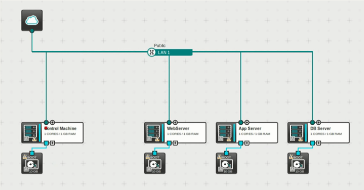

## Deploying AWS Linux servers with Ansible
--------------------------------------------

- Requires Ansible 1.x
- Distros: CentOS/RHEL/Fedora hosts

### Linux servers
-----------------

AWS Linux servers with ansible management.
Many distribution are available in AWS.
RedHat, CentOS, Fedora, Debian, Ubuntu ...etc.

### Ansible
-----------

What is ansible?
No matter your role, or what your automation goals are, Ansible can help you demonstrate value, connect teams,
and deliver efficiencies for your organization. Built on open source, Red Hat® Ansible® Automation Platform is a hardened,
tested subscription product that offers full life cycle support for organizations.
Explore how Ansible can help you automate today—and scale for the future.

How Ansible works?
Ansible® is an open source, command-line IT automation software application written in Python.
It can configure systems, deploy software, and orchestrate advanced workflows to support application deployment, system updates, and more.

Both community Ansible and Ansible Automation Platform are built on the concept of a control node and a managed node.
Ansible is executed from the control node—for example, where a user runs the ansible-playbook command.
Managed nodes are the devices being automated—for example, a Microsoft Windows server.

For automating Linux and Windows, Ansible connects to managed nodes and pushes out small programs—called Ansible modules—to them.
These programs are written to be resource models of the desired state of the system.
Ansible then executes these modules (over SSH by default), and removes them when finished.
These modules are designed to be idempotent when possible, so that they only make changes to a system when necessary.

(source: ansible.com)

Using:
- https://medium.com/@elcymarion_her/setting-up-ansible-the-easier-way-and-ssh-into-aws-ec2-7c7ed2766ed6
- ansible hosts_to_add_key -m ping -i ansible_hosts --user ubuntu -key-file ~/key/privatekey.pem
- ansible-playbook playbook.yml -i ansible_hosts --user ubuntu --key-file ~/keys/private.pem -e "key=~/.ssh/id_rsa.pub"

### Using
---------

- Put the password (mkpasswd) into the file of 'group_vars/all'
- Put the IP address of your server into the file of 'hosts'
- Play the ansible using AWS server witj ssh key files:

-  ~# ansible hosts_to_add_key -m ping -i hosts --user fedora --key-file ~/key/aws-keypair.pem
-  ~# ansible-playbook playbook.yml -i hosts --user fedora --key-file ~/keys/aws-keypair.pem -e "key=~/.ssh/id_rsa.pub"

:)
